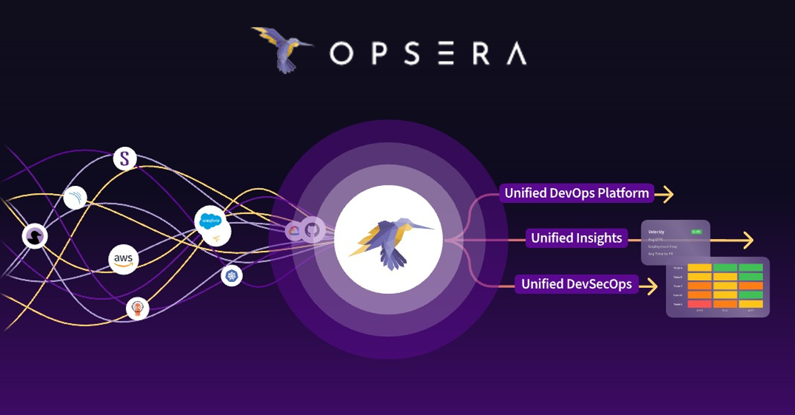

\
<p align="center">
  
</p>

<h1 align="center">Opsera LLM AI Agent</h1>

<p align="center">
  A lightweight, tool-calling AI agent built in Python, powered by Together AI and featuring a Gradio web UI.
</p>

<p align="center">
  <a href="https://www.python.org/downloads/release/python-390/"></a>
  <a href="LICENSE.md"></a>
  
  <a href="https://www.together.ai/"></a>
  <a href="https://www.gradio.app/"></a>
  <!-- Optional: <a href="#"></a> -->
</p>

## Table of Contents

- [Overview](#overview)
- [Features](#features)
- [Project Structure](#project-structure)
- [Setup Instructions](#setup-instructions)
  - [Prerequisites](#prerequisites)
  - [Installation](#installation)
  - [API Keys](#api-keys)
- [Running the Agent](#running-the-agent)
  - [Command-Line Interface (CLI)](#command-line-interface-cli)
  - [Web Interface (Gradio)](#web-interface-gradio)
- [Available Tools](#available-tools)
- [Extending with New Tools](#extending-with-new-tools)
- [Logging](#logging)
- [Troubleshooting](#troubleshooting)
- [Contributing](#contributing)
- [License](#license)

## Overview

This project implements a versatile AI agent capable of understanding user input and invoking external tools to perform tasks. It leverages the Together AI API for its core language model capabilities and provides both a command-line interface and an interactive Gradio web UI for ease of use. The agent is designed to be modular, allowing for straightforward extension with new tools and functionalities.

## Features

*   **Natural Language Understanding:** Parses user queries to determine intent and appropriate actions.
*   **Tool Invocation:** Seamlessly calls predefined tools based on user requests.
*   **Modular Tool Architecture:** Easily extendable with custom tools.
*   **Versatile File Reading:** Extracts text from plain text files (`.txt`, `.md`, `.py`, etc.) and PDF documents.
*   **Interactive Interfaces:**
    *   Command-Line Interface (CLI) for quick interactions.
    *   Gradio Web UI with file upload capabilities for a richer user experience.
*   **Configurable:** API keys, LLM model, and logging levels can be configured via an `.env` file and `config.py`.

## Project Structure

```
.
├── main.py           # Core agent logic and CLI
├── app.py            # Optional Gradio web interface
├── config.py         # Configuration for LLM, logging
├── requirements.txt  # Python dependencies
├── tools/            # Directory for tool implementations
│   ├── __init__.py
│   ├── base_tool.py    # Abstract base class for tools
│   ├── calculator.py   # Tool for mathematical calculations
│   ├── file_reader.py  # Tool for reading text from files (supports .txt, .pdf)
│   └── weather_fetcher.py # Tool for fetching weather information
├── uploads/          # Directory for files uploaded via Gradio (git-ignored)
├── .env              # For API keys and environment-specific settings (git-ignored)
├── .gitignore        # Specifies intentionally untracked files by Git
├── agent.log         # Log file for the core agent (git-ignored)
├── app.log           # Log file for the Gradio app (git-ignored)
├── opsera_logo.png   # (Example) Project logo
└── README.md         # This file
```

## Setup Instructions

### Prerequisites

*   Python 3.9 or higher
*   `pip` (Python package installer)
*   Access to the Together AI API
*   (Optional, for Weather Tool) An OpenWeatherMap API key

### Installation

1.  **Clone the Repository (or ensure you have the project files):**
    *(If you're setting this up from scratch)*
    ```bash
    # git clone <repository_url>
    # cd <repository_name>
    ```

2.  **Create and Activate a Python Virtual Environment (Recommended):**
    ```bash
    python3 -m venv .venv
    source .venv/bin/activate  # On Windows use: .venv\\Scripts\\activate
    ```
    > **Note:** Ensure your virtual environment is activated for all subsequent steps.

3.  **Install Dependencies:**
    ```bash
    pip install -r requirements.txt
    ```
    This command installs all necessary packages, including `PyPDF2` for PDF reading capabilities.

### API Keys

1.  Create a file named `.env` in the project root directory.
2.  Add your API keys and any other environment-specific configurations to this file:

    ```env
    TOGETHER_API_KEY="your_together_api_key_here"
    WEATHER_API_KEY="your_openweathermap_api_key_here" # Required for the weather tool

    # Optional:
    # LOG_LEVEL="DEBUG" # For more detailed logs (INFO, WARNING, ERROR are other options)
    # LLM_MODEL_NAME="mistralai/Mixtral-8x7B-Instruct-v0.1" # Specify a different Together AI model if needed
    ```

    *   Replace `"your_together_api_key_here"` and `"your_openweathermap_api_key_here"` with your actual API keys.
    *   The `.env` file is listed in `.gitignore`, so it will not (and should not) be committed to your version control system.

## Running the Agent

Ensure your virtual environment is activated (`source .venv/bin/activate`) before running the agent.

### Command-Line Interface (CLI)

Execute `main.py` to interact with the agent via the command line:
```bash
python main.py
```
**Example CLI Interactions:**
*   `What is (100 / (5 * 2)) + 7^2?`
*   `What's the weather like in San Francisco?`
*   `Read the content of README.md`
*   `Can you tell me what is in my_document.pdf?` (Ensure `my_document.pdf` is in the project root or specify the path)

### Web Interface (Gradio)

Launch the Gradio web UI by running `app.py`:
```bash
python app.py
```
This will typically start a local web server at `http://127.0.0.1:7860`. Open this URL in your web browser.

**Gradio UI Features:**
*   **Direct Queries:** Type your questions or commands into the chat interface.
*   **File Uploads:**
    *   Use the "Upload File" button to upload files (e.g., `.txt`, `.pdf`).
    *   Uploaded files are saved to the `uploads/` directory (this directory is git-ignored).
    *   The agent is notified of the uploaded file's path.
    *   You can then ask the agent to process the file, e.g.:
        *   "Summarize the uploaded file."
        *   "What are the key points in `uploads/your_file_name.pdf`?"
        *   If you upload a file and provide no other text, a default query like "What is in this file?" will be used.

## Available Tools

The agent comes with the following pre-configured tools:

*   **Calculator (`calculator`)**:
    *   **Description:** Evaluates mathematical expressions.
    *   **Usage:** "calculate 5 + 3 * sqrt(16)"
    *   **Features:** Supports basic arithmetic, parentheses, exponentiation (`^` or `**`), and common math functions (e.g., `sqrt`, `log`, `sin`, `cos`, `pi`, `e`).
*   **Weather Fetcher (`weather_fetcher`)**:
    *   **Description:** Fetches current weather information for a specified city.
    *   **Usage:** "what's the weather in London?"
    *   **Requires:** A valid `WEATHER_API_KEY` from OpenWeatherMap set in your `.env` file.
*   **File Reader (`file_reader`)**:
    *   **Description:** Reads textual content from various file types.
    *   **Usage:** "read the file named `my_notes.txt`" or "extract text from `uploads/report.pdf`"
    *   **Supported Formats:**
        *   Plain text files (UTF-8 encoding assumed, e.g., `.txt`, `.md`, `.py`).
        *   PDF files (text extraction via `PyPDF2`).
    *   **Parameters:** Expects a relative `file_path` (e.g., `README.md`, `uploads/document.pdf`).
    *   **Output:** Returns the extracted text content or an error message if the file cannot be processed.

## Extending with New Tools

Adding new capabilities to the agent is straightforward:

1.  **Create the Tool File:**
    *   In the `tools/` directory, create a new Python file (e.g., `my_new_tool.py`).
2.  **Define the Tool Class:**
    *   Your new class should inherit from `BaseTool` (from `tools.base_tool`).
    *   Implement the following:
        *   `@property name(self) -> str`: A unique, descriptive name for the tool (e.g., `"image_generator"`).
        *   `@property description(self) -> str`: A clear description for the LLM, explaining what the tool does, its expected input, and its output format. This is crucial for the LLM to decide when to use the tool.
        *   `get_schema(self) -> Dict[str, Any]`: A dictionary defining the JSON schema for the parameters your tool's `execute` method expects. This schema helps the LLM format its requests correctly.
        *   `execute(self, **kwargs) -> Union[str, float, dict, list]`: The core logic of your tool. It receives parameters as keyword arguments based on your schema and should return the result (e.g., a string, number, or structured data).
3.  **Register the Tool:**
    *   In `main.py`, import your new tool class.
    *   In the `initialize_agent` function, instantiate your tool and add it to the `agent.tools` dictionary (mapping the tool's name to its instance).
    ```python
    # In main.py
    # from tools.my_new_tool import MyNewTool # Example import

    def initialize_agent():
        # ... existing tools ...
        # tools["my_new_tool_name"] = MyNewTool()
        # ...
        # return agent
    ```
4.  **Update LLM Prompt (If Necessary):**
    *   While the current prompt in `main.py` is general, for highly specialized tools, you might consider refining the system prompt to give the LLM better guidance.
5.  **Add to `tools/__init__.py` (Optional but Good Practice):**
    *   Add `from .my_new_tool import MyNewTool` to `tools/__init__.py` to make imports cleaner.

> **Tip:** Write clear and concise descriptions and schemas for your tools. The LLM relies heavily on this information to determine tool usage and parameter passing.

## Logging

*   **Core Agent Activity:** Logged to `agent.log`.
*   **Gradio App Activity:** Logged to `app.log`.
*   These log files are automatically included in `.gitignore` to prevent them from being committed.
*   You can adjust the logging verbosity by setting the `LOG_LEVEL` environment variable in your `.env` file (e.g., `LOG_LEVEL="DEBUG"` for more detailed output, or `ERROR` for critical issues only).

## Troubleshooting

*   **`ModuleNotFoundError` or `ImportError`:**
    *   Ensure your Python virtual environment is activated (`source .venv/bin/activate`).
    *   Verify all dependencies are installed: `pip install -r requirements.txt`.
*   **API Key Issues (e.g., `401 Unauthorized` from Together AI or OpenWeatherMap):**
    *   Double-check that your API keys in the `.env` file are correct and have the necessary permissions.
    *   Ensure the `.env` file is in the project root and is loaded correctly (the agent logs should indicate if `.env` is loaded).
*   **PDF Reading Issues (`PYPDF2_AVAILABLE: False` in logs or errors):**
    *   Confirm `PyPDF2` is listed in `requirements.txt` and was installed correctly into your active virtual environment. You might need to reinstall dependencies.
*   **Incorrect Tool Usage or Parameter Passing by LLM:**
    *   Refine the `description` and `get_schema()` of the problematic tool to be clearer and more specific.
    *   Consider adjusting the main system prompt in `main.py` if the LLM consistently misunderstands when or how to use tools.
*   **Gradio UI Not Loading or Dark Mode Issues:**
    *   Ensure Gradio is installed and up-to-date.
    *   Try clearing your browser cache or accessing the Gradio URL in an incognito/private window to rule out caching issues with themes.

## Contributing

*(Placeholder: If you plan to accept contributions, outline the process here, e.g., fork the repo, create a feature branch, submit a pull request. Mention coding standards or tests if applicable.)*

We welcome contributions! Please follow these steps:
1. Fork the repository.
2. Create a new branch (`git checkout -b feature/your-feature-name`).
3. Make your changes.
4. Commit your changes (`git commit -m 'Add some feature'`).
5. Push to the branch (`git push origin feature/your-feature-name`).
6. Open a Pull Request.

## License

*(Placeholder: Specify the license for your project, e.g., MIT, Apache 2.0. If you add a LICENSE file, link to it.)*

This project is licensed under the MIT License - see the [LICENSE.md](LICENSE.md) file for details (you'll need to create this file). 